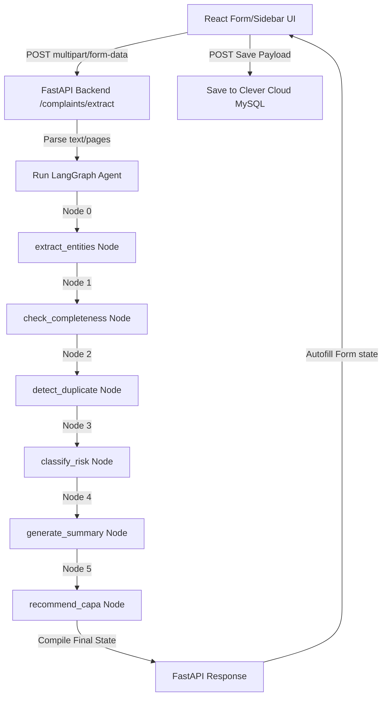

# QMS Customer Complaint AI System: Project Overview & Architecture
> **Pharmaceutical Manufacturing Compliance Intake & Triage Module (API & FDF)**

---

## 1. Executive Summary & Business Case

In the pharmaceutical manufacturing industry—governed strictly by regulatory standards such as **FDA 21 CFR Part 211** and **EU GMP Volume 4**—managing customer complaints is a critical component of the **Quality Management System (QMS)**. Quality deviations in Active Pharmaceutical Ingredients (APIs) or Finished Dosage Forms (FDFs) must be logged, risk-assessed, investigated, and linked to Corrective and Preventive Actions (CAPA) immediately.

This system automates the intake and triage process:
*   **Intake Automation**: Reduces manual entry by parsing raw emails and file documents (PDF, TXT) into structured data.
*   **AI Risk Assessment**: Classifies complaints by severity (Minor, Major, Critical) and drug category tags.
*   **CAPA Generation**: Drafts immediate corrective fixes and long-term preventive actions using LLM reasoning.
*   **Audit Readiness**: Logs audit-trail ready metadata (completeness indicators, duplicate flags) to a centralized database.

---

## 2. Technical Stack

| Layer | Technology | Details |
| :--- | :--- | :--- |
| **Frontend** | React (Vite) | Custom design system using vanilla CSS, modern typography (Inter), and custom sliding details drawer. |
| **State Management** | Redux Toolkit | Centralized slice logic (`complaintSlice.js`) managing async API actions, UI loading, and complaint states. |
| **Backend Framework** | Python FastAPI | High-performance API routing with asynchronous handler support. |
| **AI Agent Logic** | LangGraph & LangChain | Stateful graph agent orchestrating sequential LLM nodes. |
| **Large Language Model** | Groq (`llama-3.3-70b-versatile`) | High-speed, high-reasoning inference engine. |
| **Database & ORM** | MySQL + SQLAlchemy | Hosted on Clever Cloud (Managed Cloud Instance). |

---

## 3. System Architecture & Data Flow

When a QA officer drops a complaint document or pastes an email in the React app, the request follows an end-to-end pipeline:



---

## 4. LangGraph Agent Workflows

The AI backend uses **LangGraph** to construct a stateful graph of task-specific nodes:

### Node 0: Entity Extractor
Invokes the Llama 3.3 model to scan the raw text and extract core fields (Product Name, Batch Number, Customer, Strength, Quantity, Source, Priority, and Dates). It parses unstructured text like *"Mfg date was 23rd May 2025"* and converts it to a standard database-ready format (`2025-05-23`).

### Node 1: Completeness Checker
Evaluates the extracted metadata against pharmaceutical regulatory requirements. If mandatory parameters (such as `product_name`, `batch_number`, or `customer_name`) are missing, it flags `is_complete = False` and compiles a list of missing fields.

### Node 2: Duplicate Detector
Performs keyword-based pattern matching on incoming complaints against existing logs to alert the quality coordinator if a batch has been flagged for multiple deviations.

### Node 3: Risk Classifier
Applies pharmaceutical logic prompts to determine the severity:
*   **Critical**: Sterility issues, contamination, glass shards, patient adverse reactions.
*   **Major**: Subpotency, labeling mismatches.
*   **Minor**: Cosmetic packaging scuffs.

### Nodes 4 & 5: Summary & CAPA Recommender
*   **Summary**: Drafts a concise, corporate-ready summary.
*   **CAPA**: Generates a **Root Cause Analysis**, immediate **Corrective Actions** (e.g., quarantine, customer alerts, batch recall), and long-term **Preventive Actions** (e.g., supplier audits, regular validations).

---

## 5. Database Schema Details

The MySQL database schema contains the following columns for the `complaints` table:

```sql
CREATE TABLE complaints (
    id INT AUTO_INCREMENT PRIMARY KEY,
    title VARCHAR(255) NOT NULL,
    description TEXT NOT NULL,
    product_name VARCHAR(255),
    batch_number VARCHAR(100),
    customer_name VARCHAR(255),
    customer_email VARCHAR(255),
    risk_level VARCHAR(50) DEFAULT 'Unclassified',
    category VARCHAR(100),
    status VARCHAR(50) DEFAULT 'Open',
    ai_summary TEXT,
    capa TEXT,
    is_complete BOOLEAN DEFAULT TRUE,
    missing_fields TEXT,
    duplicate_flag BOOLEAN DEFAULT FALSE,
    created_at DATETIME DEFAULT CURRENT_TIMESTAMP,
    updated_at DATETIME DEFAULT CURRENT_TIMESTAMP ON UPDATE CURRENT_TIMESTAMP
);
```

---

## 6. Security & Environmental Configuration

To protect sensitive API tokens and credentials, all secrets are kept out of Git and managed as environment variables:
*   `GROQ_API_KEY`: Secret credential for the Groq inference engine.
*   `DATABASE_URL`: Production-grade connection URI for the Clever Cloud database using `mysql+pymysql://` driver schema.
